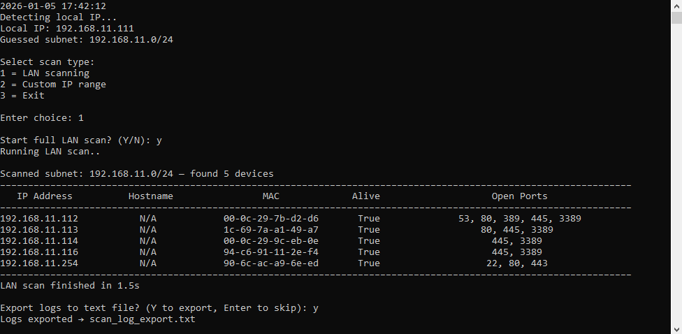

# Advanced Network Scanner

Open source, cross platform Python tool designed to discover devices on your local IPv4 network.
Built for ethical diagnostics, security awareness, and administrative auditing. Suitable for personal and organizational use.

---

## ✔️ Legal Use

This tool is intended solely for lawful and authorized use.
You must obtain explicit permission from the network owner before scanning, auditing, or testing any systems.
The author assumes no liability for misuse or for actions that violate applicable laws or organizational policies.
Use responsibly and in compliance with your local governance.

---

## ✨ Features

- **LAN Detection Mode**, detects your IPv4 subnet and scans the local network
- **Custom Scan Mode**, user can select to target a spesific IP address or IP ranges
- **Fast & Accurate**, combines ICMP, ARP, and socket checks and auto discovery
- **Port Detection**, scans common service ports (FTP, SMB, SSH, HTTP, RDP, etc)
- **Console / CLI**, clean “black console” output, stays open after completion
- **Logging system**, exportable log file (TXT format) for more detailed output

---

## ⚙️ Installation

### 1️ Requirements
- Python **3.0+**
- Works on **Windows**, **Linux**
- No external packages required

### 2️ Download
- Download [advanced_net_scanner.py](advanced_net_scanner.py)

### 3️⃣ Run
- Windows: `python advanced_net_scanner.py`
- Linux:  
      1. `chmod +x advanced_net_scanner.py`  
      2. `python3 advanced_net_scanner.py`

---
## 🖼️ Screenshot

