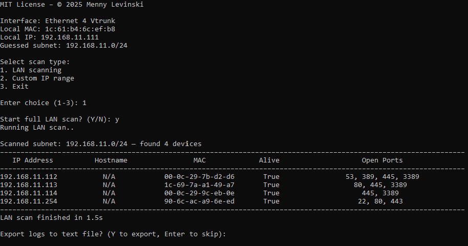

# Lite Network Scanner

Open source, cross platform Python tool designed to discover devices on your local IPv4 network.
Built for ethical diagnostics, security awareness, and administrative auditing. Suitable for personal and organizational use.

Licensed under the [MIT License](LICENSE).

---

## ✨ Features

- **LAN Detection Mode**, detects your IPv4 subnet and scans the local network
- **Custom Scan Mode**, user can select to target a spesific IP address or IP ranges
- **Fast & Accurate**, combines ICMP, ARP, and socket checks and auto discovery
- **Port Detection**, scans common service ports (FTP, SMB, SSH, HTTP, RDP, etc)
- **Terminal / CLI**, clean “black console” output, stays open after completion
- **Logging system**, exportable log file (TXT format) for more detailed output

 

---

## ✔️ Lawful Use

This tool is intended solely for lawful and authorized use.
You must obtain explicit permission from the network owner before scanning, auditing, or testing any systems.
The author assumes no liability for misuse or for actions that violate applicable laws or organizational policies.
Use responsibly and in compliance with your local governance.

---

## 📌 Safety Notice

Lite Network Scanner is safe to use when downloaded from the official source.
Because the application performs network discovery and scanning, some antivirus products may incorrectly flag or restrict its execution. This is a common false positive for legitimate network diagnostic tools.
If you trust this application, you may need to add it as an exception in your antivirus software.

---

## 💾 Installation

### Windows EXE

Download the latest [Lite_Net_Scanner_1.0.0.zip](https://github.com/mennylevinski/network_scanner/releases/download/1.0.0/Lite_Net_Scanner_1.0.0.zip). Unzip and double-click the executable to run.

No Python installation is required when using the EXE.

If Microsoft Defender SmartScreen appears:
- Click More info
- Click Run anyway

### Third Party License
Python Software Foundation License Version 2  
Copyright © 2001-2025 Python Software Foundation.  
Source: https://docs.python.org/license.html

---

### Cross Platform

#### 1️ Requirements
- Python **3.0+**
- Works on **Windows**, **Linux**
- No external packages required

#### 2️ Download
- Download [lite_net_scanner.py](script/lite_net_scanner.py)

#### 3️⃣ Run
- Windows: `python lite_net_scanner.py`
- Linux:  
      1. `chmod +x lite_net_scanner.py`  
      2. `python3 lite_net_scanner.py`
